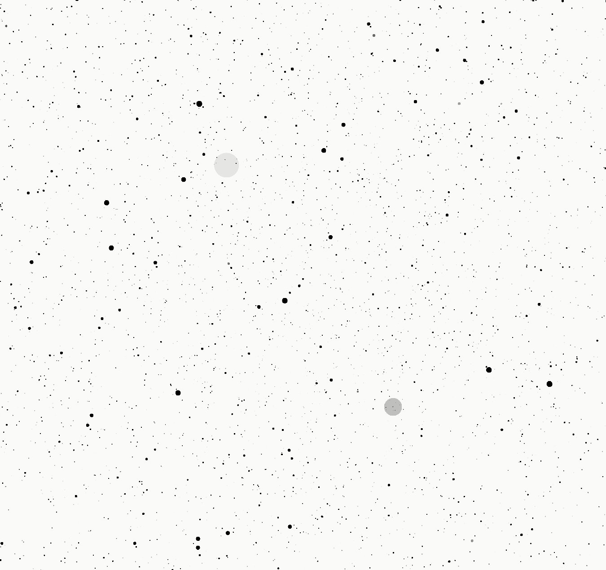
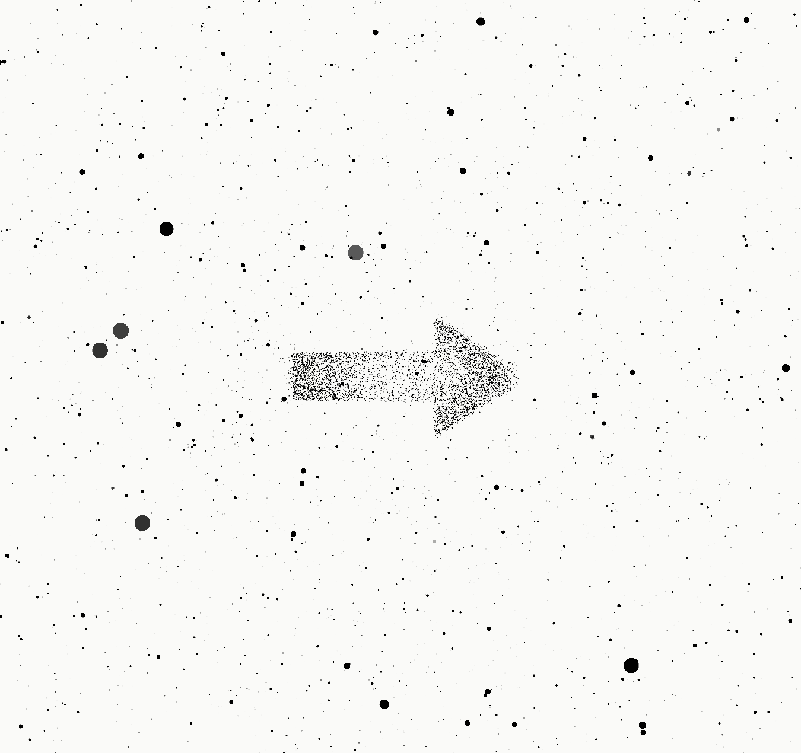
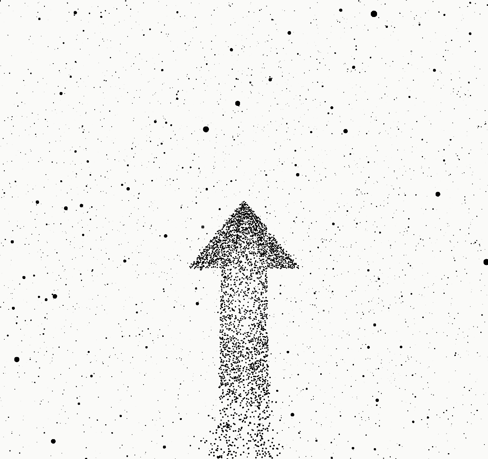

# Becoming Many Tutorial

Live: https://e-mus.github.io/becoming-many-tutorial/

Tutorial-Szene für **Becoming Many** (Icaros-VR-Flugsimulator).

Eine reinweiße Welt. Sichtbar sind nur schwarze Partikel, die dem Nichts Tiefe
geben. Das Tutorial bringt ohne ein einziges Wort bei, links/rechts und
hoch/runter zu fliegen — und **jedes** visuelle Element entsteht aus genau
diesen Partikeln.

## Was da sein soll

**Der Raum.** Die Partikel sind die Welt — sie sind alles, was es gibt. Man
fliegt ununterbrochen vorwärts und lenkt dabei die Richtung. Vor einem teilen
sich die Partikel: daran spürt man den eigenen Körper. Kein Text, keine
Anzeige, kein Ton.



**Die Sprache.** Die Welt spricht, indem sie sich umordnet. Jedes Zeichen
besteht aus den Partikeln, die ohnehin schon da sind: sie versammeln sich aus
ihrer eigenen Nachbarschaft zu einer Form und werden danach wieder loser Staub.
Wo eine Form entstanden ist, ist die Umgebung sichtbar dünner geworden — die
Form hat ihren Preis, und man sieht ihn. Zeichen entstehen weit draußen und
blenden aus der Ferne ein; wenn man sie sieht, sind sie fertig.

**Die Regie.** Vier Anweisungen: rechts, links, hoch, runter. Eine Anweisung
endet dadurch, dass man sie geflogen ist. Kein Zeitablauf schaltet weiter, keine
Assistenz steuert mit, der Raum lehnt sich nicht von selbst. Das Zeichen
antwortet auf die eigene Bewegung — es ist ein Gespräch, kein Ablauf.

### Modus 1 — Fern

Große gefüllte Pfeile stehen weltfest im Raum, weit auseinander wie Bäume an
einer Straße. Man fliegt durch sie hindurch, und solange die Anweisung offen
ist, kommt in gleichmäßigem Takt der nächste. Jeder ist aus frischen Partikeln
seiner eigenen Umgebung gebaut und sieht aus wie der erste. Ist die Anweisung
erfüllt, hört die Reihe auf.



### Modus 2 — Begleiter

Ein einziger Pfeil fliegt dauerhaft vor einem her, wie ein Schwarm, der einen
begleitet. Er zeigt in die geforderte Richtung, auch wenn man bereits in sie
fliegt. Fliegt man ihr nach, zehrt er sich von hinten nach vorn auf — im Bild
unten ist der Schaft schon halb aufgebraucht. Am Ende bleiben seine Partikel
dort stehen, wo sie gerade waren: der Pfeil bleibt als Spur im Raum zurück,
während man weiterfliegt.



## Starten

```bash
npm install
npm run dev
```

Dann die URL öffnen, die Vite ausgibt (`5173`, oder der nächste freie Port).
**WASD** fliegt, **1–2** wechselt die Führungssprache.

Die ersten 15 Sekunden sind Atempausen ohne Aufgabe: das Feld blendet auf, dann
setzt die Vorwärtsfahrt ein. Zum Überspringen gibt es URL-Parameter:

| Parameter | Wirkung |
|---|---|
| `?dev=1` | Anzeige mit Reglern, dazu `window.__becomingManyTutorial` für Messungen |
| `?beat=rechts` | direkt in eine Aufgabe (`rechts`, `links`, `hoch`, `runter`) |
| `?mode=escort` | Führungssprache vorwählen |
| `?freeze=1` | Regie anhalten, Form stehen lassen |

Vorher einmal in `chrome://gpu` prüfen, ob **WebGPU: Hardware accelerated**
steht. In der Konsole muss `[Becoming Many Tutorial] backend: WebGPU` erscheinen — steht dort
`WebGL2 fallback`, ist jede Performance-Zahl danach wertlos.

| Skript | Zweck |
|---|---|
| `npm run dev` | Dev-Server |
| `npm run check` | prüft Fortschrittsachse, Deckung und Aushöhlung jeder Form |
| `npm run verify` | typecheck + check + build |
| `npm run sync` | spiegelt den Quellcode aufs Netzlaufwerk |

## Aufbau

```
src/
  config.ts          ALLE Regelwerte      <- hier wird gestimmt
  tutorial/beats.ts  die Partitur          <- und hier
  core/              Renderer, Loop, Uniforms
  input/             WASD / Gamepad / Icaros(Stub) hinter einem Interface
  flight/            Auf-Schiene-Integrator + Kamera-Rig mit Komfortprofil
  particles/         Buffer, vier Compute-Kernel, Material
    tsl/             floorMod · drift · ambient · dissolve
  formations/        Formen -> Punktwolken mit eingebackener Fortschrittsachse
  guidance/          die zwei Sprachen hinter einem Interface
```

Zwei Dateien tragen die künstlerische Absicht und brauchen kein Engine-Wissen:
`src/config.ts` und `src/tutorial/beats.ts`.


Warum die Zahlen so sind, was vorher gescheitert ist und welche Fallen three.js
unter WebGPU stellt, steht in [docs/entscheidungen.md](docs/entscheidungen.md).

## Stand

Fertig: Partikelfeld, freier Flug mit WASD, Bugwelle, Formations-Pipeline, die
zwei Führungssprachen Fern und Begleiter, Fortschritts-Kopplung, Regie.

Offen: der VR-Durchgang (Feld-Roll statt Kamera-Roll, `renderer.xr`,
Headset-Test) und das echte Icaros — meldet es sich in
`navigator.getGamepads()`, ist [`IcarosInput`](src/input/IcarosInput.ts) dreißig
Zeilen; wenn nicht, braucht es eine native Brücke.
